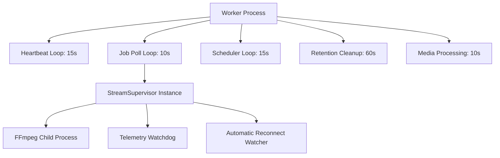
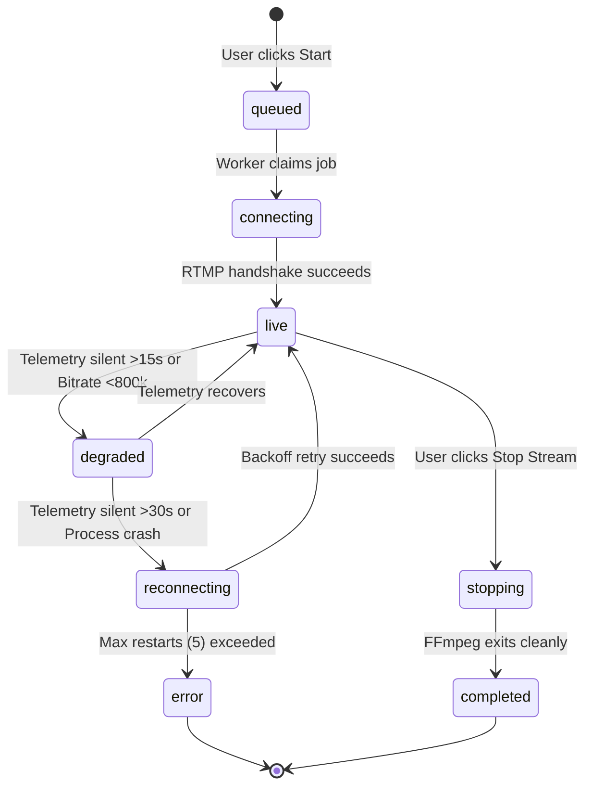

# PHASE 13 — STREAM EXECUTION ARCHITECTURE & WORKER SUPERVISOR DESIGN
**MR RAJPOOT STUDIO OBS 24/7**  
**Date**: 2026-08-31  
**Classification**: Production Streaming Architecture Specification

---

## 1. Architectural Invariant

$$\text{React UI (Control Plane)} \longrightarrow \text{Database} \longleftarrow \text{Cloud Worker (Execution Plane)} \longrightarrow \text{FFmpeg} \longrightarrow \text{YouTube RTMP}$$

- **React / Frontend**: Restricted to Control Plane operations (creating stream records, updating scenes, issuing stop commands, reading health telemetry). React never owns child processes, timers, or execution loops.
- **Worker / FFmpeg**: Fully owns the Execution Plane. The worker claims jobs from Supabase, spins up a dedicated `StreamSupervisor`, resolves credentials via encrypted Vault RPCs, assembles multi-layered lavfi filtergraphs, and transmits real-time video to YouTube RTMP.
- **Database**: Single source of truth. Telemetry is written directly by the supervisor to `stream_analytics` and `streams.updated_at`. Realtime distributes updates to connected browser clients.

---

## 2. Decoupled Worker Execution Model

To prevent blocking or task starvation across unrelated jobs, the worker engine executes five isolated, non-blocking asynchronous loops:

1. **Heartbeat Loop (15s)**: Updates `worker_nodes.last_heartbeat` with active process count.
2. **Job Poll Loop (10s)**: Claims queued streams and handles graceful stop requests asynchronously without blocking.
3. **Scheduler Loop (15s)**: Evaluates due automated schedules.
4. **Retention Cleanup (60s)**: Purges expired logs and records.
5. **Media Processing (10s)**: Generates thumbnails and extracts probe metadata.

---

## 3. StreamSupervisor Lifecycle & State Transitions

The `StreamSupervisor` class encapsulates the full lifecycle of each broadcast:

---

## 4. Input Pacing & Network Resilience

1. **Real-Time Pacing (`-re`)**:
   - Injected on the lavfi background color canvas and all video/image inputs.
   - Paces FFmpeg transmission strictly at $1.00\text{x}$ wall-clock speed.
2. **HTTPS Storage Reconnect Flags**:
   - Remote storage inputs use `-reconnect 1 -reconnect_at_eof 1 -reconnect_streamed 1 -reconnect_delay_max 5`.
   - Protects against storage TCP keep-alive socket drops.
3. **Pacing Watchdog**:
   - Evaluates `speed=([\d.]+)x` from stderr. If speed deviates outside $0.75\text{x} - 1.25\text{x}$, warning alerts are triggered.
