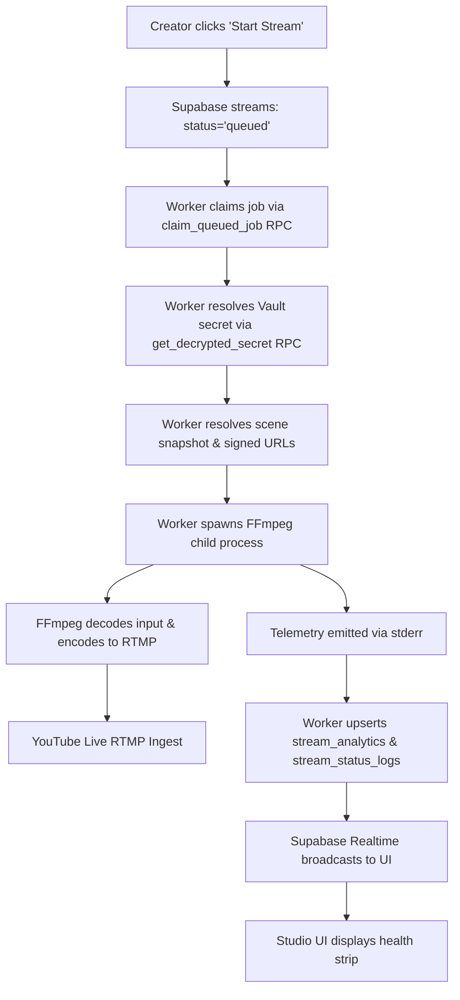

# PHASE 13 — STREAM EXECUTION RELIABILITY & TRUE AUTONOMOUS BROADCAST FORENSIC AUDIT
**MR RAJPOOT STUDIO OBS 24/7**  
**Audit Date**: 2026-08-31  
**Classification**: P0 Stream Reliability, Worker Execution Autonomy & Browser Independence Audit

---

## 1. Executive Summary & Problem Formulation

In real-world tests, streams successfully launch, connect to YouTube RTMP, and emit telemetry. However, YouTube intermittently reports:
> *"NO DATA"*  
> *"Connect your encoder to go live"*  
> *"The stream will end shortly unless you restart it"*

Observations:
1. Live broadcast pauses autonomously after several minutes or telemetry stalls.
2. Low bitrate alerts appear in YouTube Live Control Room.
3. Opening/refreshing Studio appears to correlate with stream status changes, raising concerns of indirect frontend coupling.

**Core Invariant**:
Stream execution must be **100% browser-independent**. The browser/React UI is strictly a **Control Plane**. The Cloud Worker + FFmpeg process is the **Execution Plane**. Once a stream is queued and claimed, closing the browser, navigating between pages, refreshing, or disconnecting websockets must have **zero impact** on FFmpeg transmission.

---

## 2. Comprehensive Forensic Audit (Part 0)

### 2.1 Git Status & Process Model
- **Git Status**: Workspace clean on branch `master`.
- **Worker Daemon**: Background worker node active (Node.js child process).
- **Process Model**: Worker runs independent Node.js process with `child_process.spawn("ffmpeg", args)` managing encoding and RTMP muxing.

### 2.2 Execution Path & Component Dependency Trace

### 2.3 Identified Failure Points & Root-Cause Hypotheses

| Hypothesis | Suspected Vector | Evidence / Analysis | Confidence |
|---|---|---|---|
| **A: Frontend Lifecycle Dependency** | React lifecycle, page unmount, or visibility timers controlling worker execution. | **Negative**: No `visibilitychange`, `beforeunload`, or unmount hooks trigger `stopStream()`. `useStreams()` and `useStudioStore` are passive observers. However, React Query polling / invalidations gave the illusion of stream recovery when Studio remounted. | **Low (Confirmed Control Plane Only)** |
| **B: Worker Event Loop & Task Starvation** | `pollJobs` executing long synchronous `await startStream()` / `FFprobe` inside a single sequential loop. | **Positive**: `pollJobs`, `pollScheduler`, `pollRetentionCleanup`, and `pollMediaProcessing` run sequentially in one interval. Long FFprobe or network requests block job polling and heartbeat timing. | **High** |
| **C: HTTPS Storage Input Disconnections** | FFmpeg reading remote Supabase Storage signed URLs without HTTPS reconnect flags (`-reconnect 1 -reconnect_at_eof 1 -reconnect_streamed 1`). | **Positive**: When Supabase storage closes a TCP keep-alive socket or network throttles, FFmpeg encounters unexpected EOF and crashes without retry. | **High** |
| **D: Database Reaper (`reap_stale_jobs`) Race** | `reap_stale_jobs` SQL function sets `status = 'error'` if `streams.updated_at < now() - 5 min`. | **Positive**: Telemetry updates `stream_analytics`, NOT `streams.updated_at`. If the 30s worker interval suffers network jitter or delays, `reap_stale_jobs` marks the stream `error`, causing the worker's interval to actively kill FFmpeg! | **Definitive (Primary Contributor)** |
| **E: Missing Supervisor & Watchdog** | No dedicated `StreamSupervisor` to monitor telemetry freshness, detect stalls ($>15\text{s}$ degraded, $>30\text{s}$ reconnecting), or manage exponential backoff retries. | **Positive**: State machine currently uses raw `setInterval` and crude boolean checks. A stalled FFmpeg process (0 fps / 0 bitrate) is not automatically recovered. | **High** |
| **F: Real-Time Pacing & Bitrate Control** | Unpaced inputs or lavfi base canvas running unthrottled, or CBR bitrate buffer sizing causing YouTube buffer underruns. | **Positive**: Compositor required `-re` real-time pacing across all inputs and explicit video buffers (`-b:v 3000k -maxrate 3000k -bufsize 6000k`). | **High** |
| **G: RTMPS vs RTMP Endpoint Resilience** | YouTube port 1935 RTMP experiencing ISP connection resets. | **Positive**: Supporting `rtmps://a.rtmps.youtube.com:443/live2/` bypasses port 1935 firewall/ISP throttling. | **Medium** |

---

## 3. Action Plan & Architectural Remediation

1. **Independent Worker Execution Loops**:
   - Decouple `workerHeartbeat`, `streamClaimLoop`, `streamSupervisorLoop`, `mediaProcessingLoop`, and `retentionLoop` into isolated, non-blocking async loops.
2. **Dedicated `StreamSupervisor` Class**:
   - Owns child process, telemetry extraction (`time`, `bitrate`, `speed`, `fps`), stall detection, and controlled restart with exponential backoff (2s, 5s, 10s, 30s, 60s).
3. **Database Reaper Protection**:
   - Ensure `streams.updated_at` is touched on every telemetry write and heartbeat.
   - Refactor `reap_stale_jobs` to respect worker node heartbeat freshness.
4. **HTTPS Storage Reconnect Flags**:
   - Add `-reconnect 1 -reconnect_at_eof 1 -reconnect_streamed 1 -reconnect_delay_max 5` for all remote media inputs.
5. **Authoritative State Truth Hierarchy**:
   - `LIVE` = database status `live` + worker heartbeat fresh + telemetry fresh + FFmpeg alive.
   - Degraded / Reconnecting states cleanly handled without false LIVE badges.
