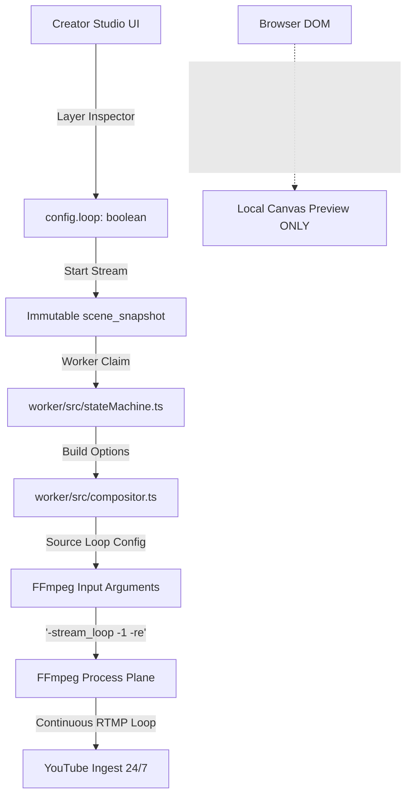

# PHASE 14 — MEDIA PLAYBACK LOOPING ARCHITECTURE SPECIFICATION
**MR RAJPOOT STUDIO OBS 24/7**  
**Date**: 2026-08-31  
**Classification**: Continuous Playback & Compositor Execution Plane Specification

---

## 1. Separation of Browser Preview vs Worker Broadcast Looping

- **Browser Preview Loop**: Controlled by React DOM `<video loop={config.loop ?? true} />` and `<MediaPreview />`. Used strictly for local creator feedback while editing.
- **Worker/FFmpeg Broadcast Loop**: Authoritative execution plane. The compositor evaluates `(source.config as any)?.loop !== false`, attaching `-stream_loop -1` directly before the `-re` and `-i <url>` input arguments for each video and audio layer.

---

## 2. Source-Level Looping Semantics

| Source Type | Default Loop Setting | FFmpeg Argument Formulation | Behavior at EOF |
|---|---|---|---|
| **Video** | `loop: true` | `-stream_loop -1 -re ... -i <url>` | Demuxer restarts from frame 0 continuously. |
| **Audio** | `loop: true` | `-stream_loop -1 -re ... -i <url>` | Demuxer restarts audio track continuously. |
| **Image** | N/A (Persistent) | `-re -loop 1 -t 999999999 -i <url>` | Static frame held indefinitely with real-time pacing. |
| **Text** | N/A (Persistent) | `drawtext` filter node on base canvas | Text overlay drawn continuously on video stream. |
| **Overlay** | N/A (Persistent) | `-re -loop 1 -t 999999999 -i <url>` | Graphic overlay held indefinitely with alpha channel. |

---

## 3. Real-Time Pacing Guarantee

To prevent video packets from being transmitted faster than wall-clock speed during looped playback:
1. Every looped video and audio input receives `-re` (real-time read rate limit).
2. The base canvas generator (`-f lavfi -i color=c=black:s=...:r=30`) paces the global timeline.
3. Video encoding buffers enforce Constant Bitrate (CBR): `-b:v 3000k -maxrate 3000k -bufsize 6000k`.
4. Stderr telemetry is monitored by `StreamSupervisor` with a pacing watchdog verifying $0.90\text{x} \le \text{speed} \le 1.10\text{x}$.
