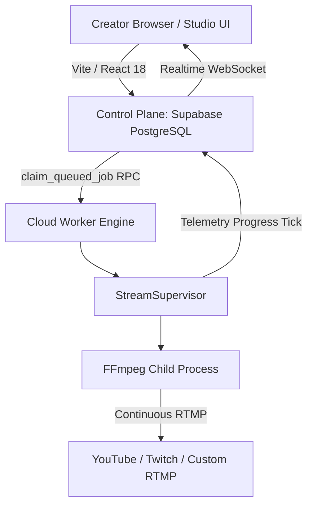

# PHASE 15 — PRODUCTION ARCHITECTURE SPECIFICATION
**MR RAJPOOT STUDIO OBS 24/7**  
**Date**: 2026-08-31  
**Classification**: Production Architecture Specification

---

## 1. Core Production Principle

$$\textbf{SIMPLE CREATOR WORKFLOW} \quad + \quad \textbf{ROBUST DISTRIBUTED ENGINE}$$

- **Creator Interface**: Upload $\rightarrow$ Add to Scene $\rightarrow$ Loop Continuously $\rightarrow$ Start $\rightarrow$ Forget.
- **Backend Architecture**: Decoupled Control Plane (Supabase) + Autonomous Execution Plane (Node.js Worker Daemon & FFmpeg).

---

## 2. Decoupled Subsystem Loops

The Cloud Worker executes five isolated asynchronous loops to guarantee zero task starvation:

1. **Heartbeat Loop (15s)**: Upserts `worker_nodes.last_heartbeat` with active process count.
2. **Job Polling Loop (10s)**: Claims queued broadcasts via `claim_queued_job` RPC and handles graceful stops.
3. **Scheduler Loop (15s)**: Triggers due automated time-based broadcasts.
4. **Retention Loop (60s)**: Prunes expired media assets and logs according to tier retention limits.
5. **Media Processor Loop (10s)**: Probes video metadata and extracts automatic thumbnails via FFprobe.
6. **Health Self-Check (300s)**: Emits structured memory heap and subsystem status reports.

---

## 3. Environment & Security Boundaries

- **Client Environment (`.env.local`)**: Exposes only public `VITE_` variables (`VITE_SUPABASE_URL`, `VITE_SUPABASE_ANON_KEY`, `VITE_STRIPE_PUBLISHABLE_KEY`).
- **Server Environment (`worker/.env`)**: Contains `SUPABASE_SERVICE_ROLE_KEY` and `STRIPE_SECRET_KEY`. Never bundled into client builds.
- **Credentials & Stream Keys**: Encrypted in PostgreSQL Supabase Vault; resolved via atomic `get_decrypted_secret` RPCs.
